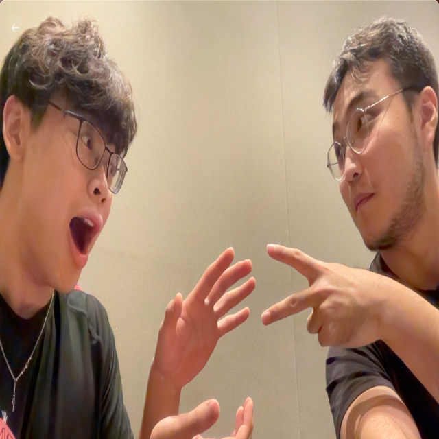
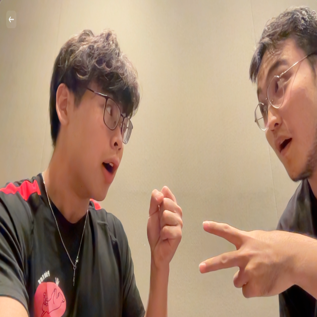
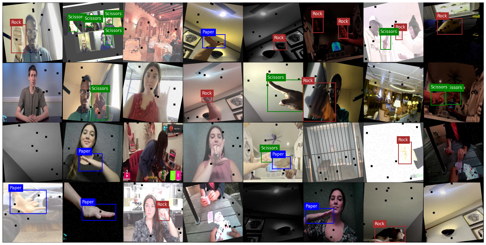

# ✂️ Rock Paper Scissors — Computer Vision


Final project for the NYUAD Fall '23 Machine Learning course with Professor [Keith Ross](https://engineering.nyu.edu/faculty/keith-ross). Built with [Tengis Gantulga](https://github.com/tengis0).

---

## Overview

Can a model learn to play Rock Paper Scissors by watching your hand? That was the question. We trained a computer vision model to detect and classify hand gestures — rock, paper, scissors, or irrelevant — from images, and built a game interface that reads from a live webcam feed.

The project took two passes: first building a custom CNN from scratch, then pivoting to fine-tune a pre-trained YOLOv5 model when the custom approach hit a hard engineering wall.

[](https://youtu.be/OIZLeyjSEeA)

---

## Dataset

From [Roboflow](https://roboflow.com/) — 15,874 labeled images across 4 classes:

| Split | Images |
|---|---|
| Train | 14,966 |
| Validation | 588 |
| Test | 320 |

Classes: `Rock`, `Paper`, `Scissors`, `Irrelevant`

Each image comes with bounding box annotations in YOLO format (class + normalized x, y, w, h).

---

## Approach

### Phase 1 — Custom CNN

We first built a convolutional neural network from scratch in PyTorch, similar to our CIFAR-10 work in HW 5, but adapted for 640×640 images and multi-label detection with bounding box regression.

**Architecture:**
```
Input: 3 × 640 × 640
→ Conv2d(3→32) + ReLU + MaxPool → 32 × 320 × 320
→ Conv2d(32→64) + ReLU + MaxPool → 64 × 160 × 160
→ Conv2d(64→128) + ReLU + MaxPool → 128 × 80 × 80
→ Flatten → Linear → class logits + bbox coordinates
```

**The problem we ran into:** Each image in the dataset has a variable number of bounding boxes (e.g., one hand vs. two hands in frame). PyTorch's DataLoader expects uniform tensor shapes within a batch, so we had to pad bounding box tensors to a maximum count per batch. Getting the padding, collation, and loss calculation to all agree on tensor shapes proved to be a persistent blocker that prevented the model from training cleanly.

### Phase 2 — YOLOv5

Rather than continue fighting the variable tensor issue, we pivoted to **YOLOv5** — a state-of-the-art real-time object detection model — and fine-tuned it on our dataset. YOLO handles variable bounding boxes natively as part of its architecture.

- Base model: `yolov5s.pt` (small, fast variant)
- Fine-tuned for 5 epochs on our Roboflow dataset
- Image size: 640×640, batch size: 32
- The trained weights (`weights/best.pt`) are included in this repo

**Sample detections:**

<table>
  <tr>
    <td></td>
    <td></td>
    <td></td>
  </tr>
  <tr>
    <td align="center"><em>Paper, Scissors</em></td>
    <td align="center"><em>Rock, Scissors</em></td>
    <td align="center"><em>Batch sample</em></td>
  </tr>
</table>

---

## Game Interface

`game_interface.py` is a desktop app (tkinter + OpenCV) that opens a live webcam feed and plays Rock Paper Scissors against the computer. The model reads your hand gesture from the camera frame, and the app resolves the round.

```bash
pip install opencv-python pillow
python game_interface.py
```

---

## Repo Structure

```
rps-computer-vision/
├── notebooks/
│   ├── final_project.ipynb   # Main notebook: custom CNN + YOLOv5 training
│   └── single_label.ipynb    # Earlier single-label classification exploration
├── weights/
│   └── best.pt               # YOLOv5 fine-tuned weights
├── assets/
│   ├── test_image_1.png
│   ├── test_image_2.png
│   └── batch_sample.png
└── game_interface.py         # Webcam-based RPS game app
```

---

## Demo

📄 Full writeup and results on [Notion](https://edison-chen.notion.site/Rock-Paper-Scissors-w-Computer-Vision-CNNs-434b4dd7571e477fb7c53060f788508b?pvs=74)

---

## Team

| Member | GitHub |
|---|---|
| Edison Chen | [@ebc5802](https://github.com/ebc5802) |
| Tengis Otgonbaatar | [LinkedIn](https://www.linkedin.com/in/otengis/) |
